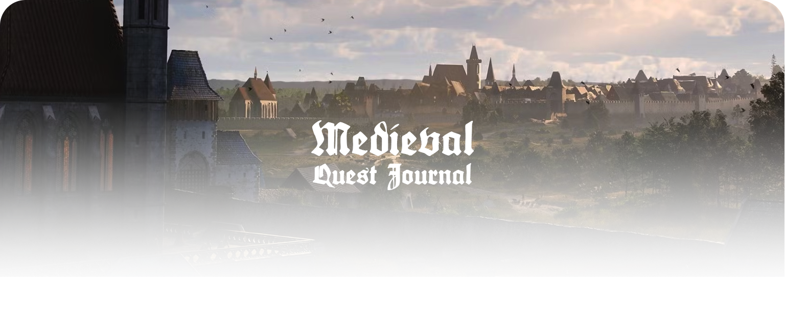

# Medieval Quest Journal

A medieval‑inspired quest tracker with a rich 3‑column UI (cards → list → log), a tiny Flask API, and a file‑based data store. Drag‑and‑drop reordering, nested (parent/child) quests, subtasks with progress, and a notes editor are all built in.

---


## Demo & Screenshot

[Medieval Quest Journal](https://medievalquestmanager.up.railway.app/)

 

 
---

## Run Locally

```bash
python3 app.py
```

---

## Features

- **Three‑column layout**
  - **Card stack** on the left (max 3 active quests, scaled to fit the viewport)
  - **Quest list** in the middle with tabs (All / Main / Side / Task / Done)
  - **Log pane** on the right with subtasks + notes
- **Categories & state**
  - `main`, `side`, `task`, `done` categories
  - "Max 3 active" rule for cards; finished quests move to **Done** and remember their previous category via `prevCat`
- **Parent → child hierarchy**
  - Any quest may be assigned a `parent` (nullable, stored as `null` when no parent)
  - Children render under their parent with a collapsible twisty
- **Persistent subtasks**
  - Check/uncheck subtasks, inline add, and **drag to reorder** (saved to disk)
  - Automatic progress badge per quest (percent done)
- **Inline notes**
  - Modal notes editor per quest (`notes` field in data)
- **Reordering with visuals**
  - Drag/reorder quests in the middle list; position hint line and smooth transitions
  - Drag handle is the entire row; drop position indicated by a subtle line
- **State that survives refreshes**
  - Server data in `quests.json`
  - Client UI state in `localStorage` (`questOrder`, `openQuests`)
- **Theming & art**
  - All UI art lives in `static/` (parchment, borders, shields, triangle icon, etc.)

---

## Project structure

```
./
├── app.py               # Flask app & API endpoints
├── quests.json          # File‑based data store
└── static/
    ├── index.html       # Front‑end (HTML, CSS, JS in one file)
    ├── triangle.png     # Twisty icon for expanding/collapsing children
    ├── shield-*.png     # Category shields (main/side/task/done)
    ├── border*.png      # Frame assets
    ├── blue-tile.png    # Background
    ├── paper-background.png
    ├── ...              # other images referenced by index.html
```

> If you are running from this repo, be sure `index.html` and all assets are inside `static/` (the Flask app serves this folder).

---

## Quickstart

**Requirements**

- Python 3.9+
- `pip install flask`

**Run**

```bash
python app.py
# → Serving on http://127.0.0.1:5000
```

Open `http://localhost:5000/` in your browser.

**Data persistence**

- All quests are stored in `quests.json` (written by the API).
- UI state is stored in your browser’s `localStorage`:
  - `questOrder` – array of quest IDs reflecting the list order
  - `openQuests` – array of quest IDs that are expanded in the list

> Tip: If you change `quests.json` while the app is running, refresh the page to see updates.

---

## Data model (quests)

Each quest in `quests.json` roughly looks like:

```json
{
  "id": "1745672116415",          // string; unique identifier
  "title": "Voice of Remembrance", // display title
  "category": "main",             // main | side | task | done
  "objective": "…",               // short blurb shown on the card/log
  "description": "…",             // longer text shown in log
  "subtasks": [                     // checklist items
    { "text": "Assemble the hardware", "done": true },
    { "text": "Upload a functioning code", "done": false }
  ],
  "active": true,                  // controls appearance as a big card
  "prevCat": "main",              // original category (for Done tab grouping)
  "notes": "…",                   // free‑form notes (HTML escaped)
  "parent": null,                  // parent quest id, or null when none
  "children": ["…"],              // optional helper list; maintained by UI
  "_open": false                   // UI convenience flag (not required)
}
```

### Category rules

- When a quest is marked **Done**, it moves to `category: "done"` and its previous category is saved in `prevCat`. The **Done** tab and All‑tab “Finished” bucket are built from this.
- When un‑done, it returns to `prevCat`.

### Parent/child rules

- Choosing **Parent Quest** in the editor sets `parent` (or `null`).
- The editor also maintains each parent’s `children` array so the UI can render quickly. Children are hidden as separate roots in category tabs.

---

## Front‑end behavior

- **Cards** (left column)
  - Shows up to 3 *active* quests (in order). Finishing a quest hides it from the card stack.
- **List** (middle column)
  - Tabs: All / Main / Side / Task / Done
  - Buckets: In the All tab you’ll see headings for Main, Side, Task, and Finished; finished items are only shown in the **Finished** bucket.
  - Reorder quests via drag‑and‑drop; the drop position is indicated with a line. Order is saved to `localStorage` (`questOrder`).
  - Expand/collapse children with the **twisty** (uses `triangle.png`). Open state is saved in `localStorage` (`openQuests`).
  - **Activate/Deactivate** toggles whether a quest appears as a card (max three active at once).
- **Log** (right column)
  - Scrollable parchment. Subtasks can be toggled and reordered (drag) and are saved immediately.
  - **Notes** button opens a modal editor; changes persist to `quests.json`.

---

## API

Base URL: `http://localhost:5000/api`

### `GET /quests`

Returns the full quest list.

### `POST /quests/blank`

Creates a new blank quest on the server and returns it. The front‑end may immediately open the editor.

**Response** (example)

```json
{
  "id": "1746017555944",
  "title": "New Quest",
  "category": "side",
  "objective": "",
  "description": "",
  "subtasks": [],
  "active": true,
  "prevCat": "side",
  "notes": "",
  "parent": null
}
```

### `PUT /quests/<id>`

Updates a quest in place. The front‑end sends the full quest object (merged server‑side).

### `DELETE /quests/<id>`

Deletes a quest by id.

> The API writes to `quests.json` in the project root. It’s simple and not concurrent‑safe; perfect for a personal tool or demo, not for multi‑user production.

---

## Customization

- **Triangle / twisty icon**
  - Place `triangle.png` in `static/`.
  - The CSS expects `.twisty { background: url("triangle.png") center/contain no-repeat; }` and rotates it for open/closed.
- **Shields & art**
  - Replace `shield-main.png`, `shield-side.png`, `shield-task.png`, `shield-done.png` in `static/`.
  - Backgrounds and parchment edges are ordinary PNGs; swap as you like.
- **Card sizing**
  - The card stack uses CSS custom properties (see `CSS Quest Card Layout` snippet) to fit all three cards into the viewport. Tweak `--ratio-main`, `--card-gap`, etc.

---

## Tips & troubleshooting

- **I can’t see more than 3 cards** → That’s intentional. Deactivate or finish a quest to free a slot.
- **Done tab is empty** → Ensure finished quests actually have `category: "done"` and a `prevCat` set. The editor’s **Mark Done** button handles this for you.
- **Children appear as roots** → A child should have `parent: <id>`; the category tabs intentionally hide children from the root lists.
- **Open state didn’t persist** → Open/closed state is stored in `localStorage` (`openQuests`). Clearing site data resets it.
- **Assets 404** → Make sure all images referenced by `index.html` are in `static/`.

---

## Roadmap (nice‑to‑haves)

- Keyboard interactions (quick add, navigate, toggle)
- Search & filters
- Undo/redo for edits and deletes
- Multi‑user / DB backend (SQLite/Postgres) with auth
- Unit tests for the API

---

## Contributing

PRs welcome! Please:

1. Open an issue describing the change.
2. Keep front‑end assets under `static/`.
3. Avoid breaking the file format of `quests.json`.

---

## License

MIT – see `LICENSE` (or choose a license you prefer).


The parchment UI, shields, and decorative borders are adapted from custom artwork. Fonts: *Cinzel* (Google Fonts) and a display serif for headers.

